##我行我素购物管理系统项目总结

---
这是一个比较水的练手项目，对于初学Java的新手来说比较适合练手，
该项目的主要来源是我暑假参加工程实践，按老师给的需求个人开发的玩具项目，不足之处，还望指点。

##1.项目的起始界面：

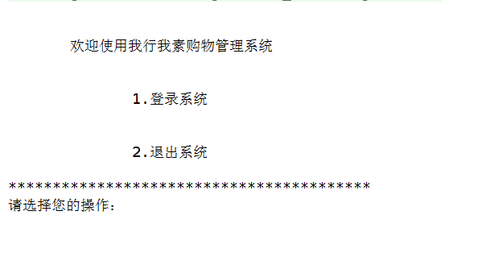

##2.登录系统

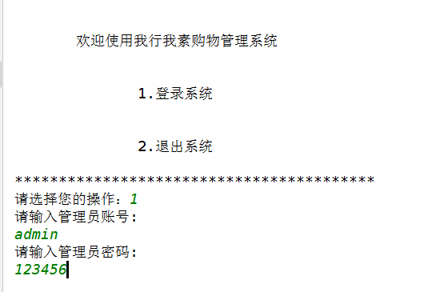

     对错误登录进行限制3次机会

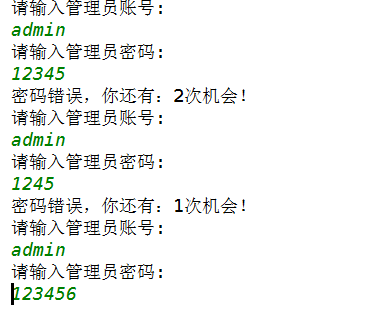

##3.进入管理系统的主菜单

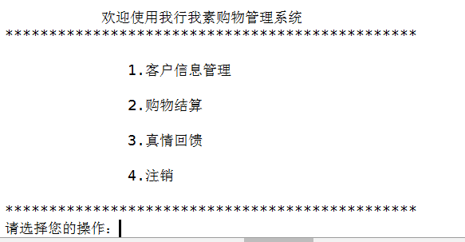

###（1）选择客户管理子系统

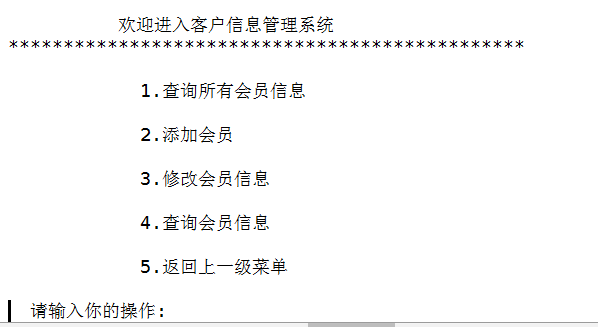

###选择查询所有会员用户信息
 
 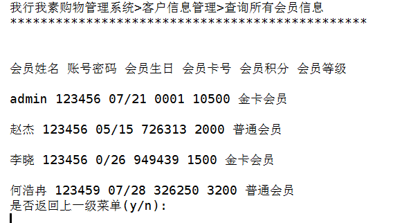

####选择查询添加会员用户信息

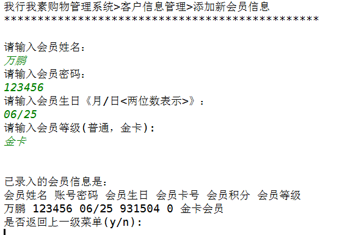

####选择查询修改会员用户信息

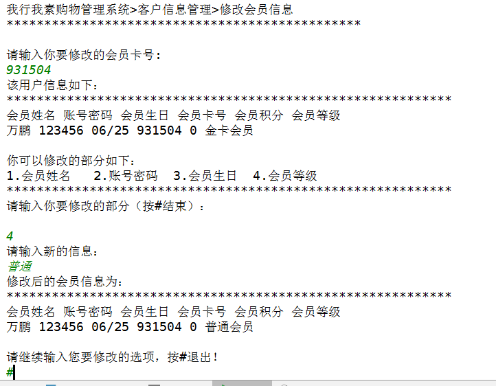

####选择查询查看指定会员用户信息

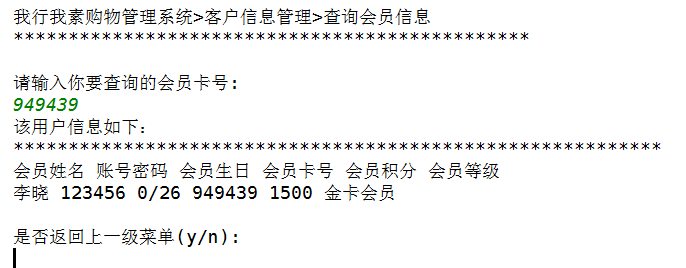

###(2)选择购物积分结算系统

该部分模块相当于超市中收款的扫码枪，通过购物金额和会员卡对客户会员的积分进行更新。

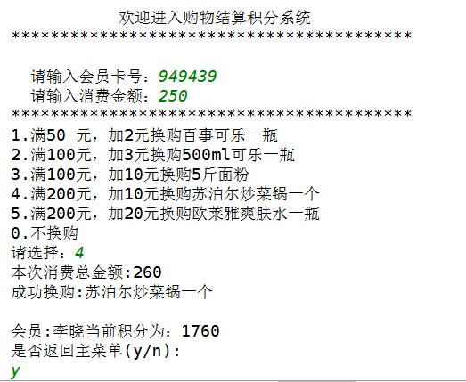

满足一定的金额后可进行换购满足不了一定的金额积分，则不能够换购。

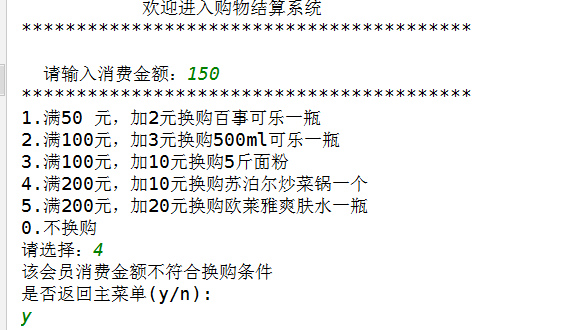

###(3)选择真情大回馈系统，该部分主要分为3个项目：（1）幸运大放送（2）幸运抽奖（3）生日问候

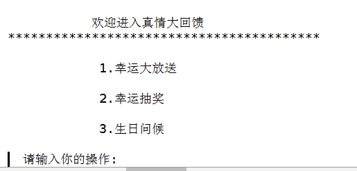

幸运大放送模块主要是根据会员的卡等级，分为普通会员和黄金会员，普通会员满3000积分才可兑换500积分奖励，而黄金会员则需要满足1000积分便可兑换积分500.

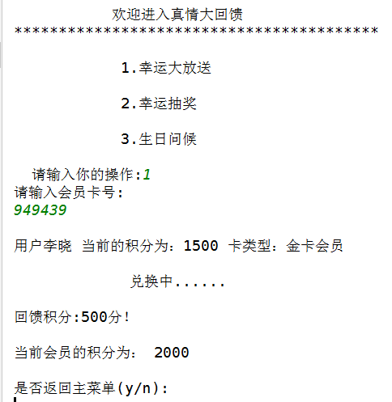

*注意：积分不足则不能够兑换

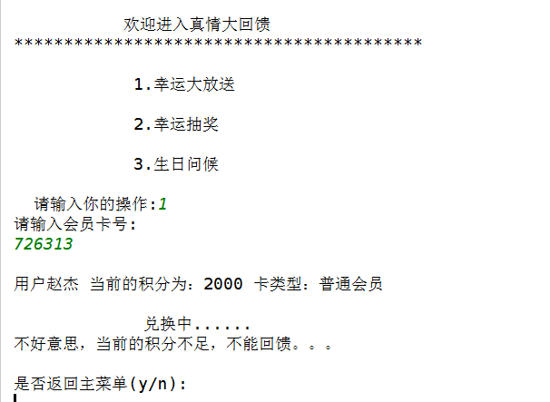

幸运抽奖模块主要是双色球模式的产生5个随机中奖号码，将该会员的卡号与中奖号码比对，相同则为中奖用户！！

生日问候部分主要是对会员顾客生日当天进行积分赠送当做生日回馈。

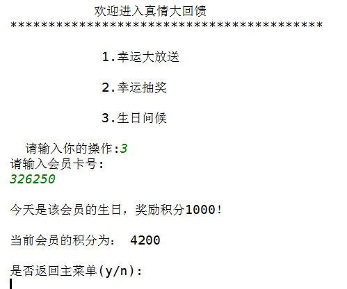

当天不是会员顾客生日则不兑换

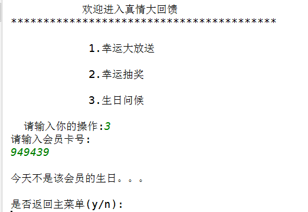

接下来在主页面选择注销后，返回主菜单退出系统，则该进程结束。

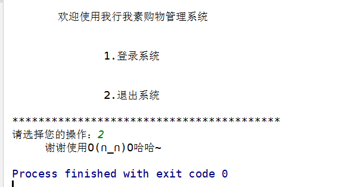

**该项目使用IDEA开发，通过Mysql进行用户会员的信息存储与更新，一个简单的demo小项目供初学者练手。您要是喜欢还请多多star.
  O(∩_∩)O哈哈~**